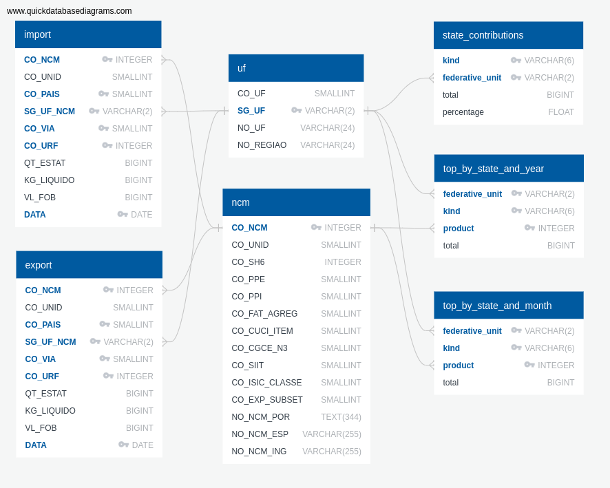

# Setup

## Quick start

### See it in action

The dashboard is currently available at https://import-export-dashboard.herokuapp.com.

### Deployment a new instance

To deploy the dashboard on Heroku, just run the following command, replacing
`my-new-dashboard` by a name of your choice.

```bash
git clone git@github.com:he7d3r/desafio-engenharia-dados.git
cd desafio-engenharia-dados
heroku container:login
heroku create my-new-dashboard
docker-compose build app
docker tag desafio-engenharia-dados_app:latest registry.heroku.com/my-new-dashboard/web
docker push registry.heroku.com/my-new-dashboard/web
heroku container:release web
heroku addons:create heroku-postgresql:hobby-dev
heroku run make all
```

Wait a few minutes, while the raw data is downloaded, transformed, loaded into
the database and some sanity checks are performed. Once it is done, you should
be able to access the dashboard at <https://my-new-dashboard.herokuapp.com>.

### Run locally

After cloning the project, and going to its folder, use Docker Compose to build and run the images as follows:

```bash
docker-compose up -d
```

This should take care of building the images and running the following:

- Start a cron job to download the raw data (if not already done) into the `data` folder
- Create and populate a SQLite database in the same directory
- Do a sanity test of the data
- Make the dashboard app available at http://localhost:80 (via nginx), and at URLs such as http://localhost/dashboard/SC/2019, where "SC" and "2019" can be replaced by other state codes and years respectively.

### Other useful commands

#### Debugging

You can toggle Flask's debug mode by setting the FLASK_ENV environment variable
to `production` or `development`, like this:

```bash
FLASK_ENV=development docker-compose up -d app
```

or by adding the same setting to a `.env` file:

```bash
echo "FLASK_ENV=development" >> .env
```

#### Get the data into an SQLite database

To get a container to download the data and populate the database, run the following (replacing `<img_name>` with a name of your choice):

```bash
docker build -f dashboard/Dockerfile -t <img_name> .
docker run -it -e DATABASE_URL='sqlite:////data/trades.db' \
    -v `pwd`/data:/data \
    -v `pwd`/dashboard/src:/dashboard/src \
    --name <container_name> <img_name> \
    /bin/bash
make /data/trades.db # Inside the container
```

#### Check the cron service status

You can check the status of the cron service like this:

```bash
docker exec -it <container_id> service cron status
```

#### Test the database

After making changes to the data pipeline, it can be useful to check if the database still contains the expected data. For this, just run `make tests` inside the `flask` container, that is:

```bash
docker-compose up -d app
docker exec -it flask make tests
```

This will ensure a reasonable number of rows is present in each table.

#### Get the Flask app running

To build and run the app image:

```shell
docker build -f dashboard/Dockerfile -t <img_name> .
docker run -d -e FLASK_APP='wsgi' \
    -e FLASK_ENV='development' \
    -e DATABASE_URL='sqlite:////data/trades.db' \
    -p 5000:5000 \
    -v `pwd`/data:/data \
    -v `pwd`/dashboard/src:/dashboard/src \
    --name <container_name> <img_name> \
    gunicorn --reload --bind 0.0.0.0:5000 --workers 4 "wsgi:app"
```

In this example, the app should be be available at http://localhost:5000/. If needed, add the option `--reload` to allow changes made to app source code (inside the folder `dashboard/src` on the host) to go live without needing to rebuild its image (reloading the page in the browser will be enough).

### Running tests

To run some basic tests, use

```bash
pytest
```

## Notes

For a first look into the data, check out the Jupyter notebooks inside the directory `notebooks`.

## Database Layout

Currently, the dashboard uses a database with the following tables:


