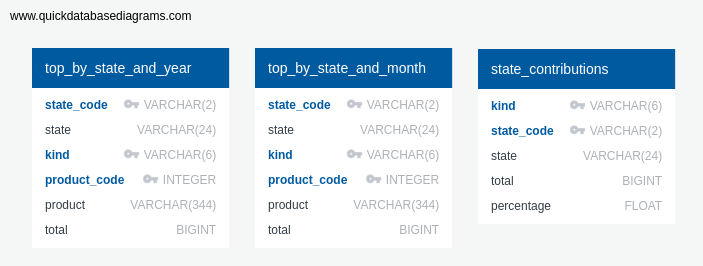

# Setup

## Quick start
### Using Docker Compose
After cloning the project, and going to its folder, use Docker Compose to build and run the images as follows:
```bash
docker-compose up -d
```

This will start the cron job, the flask app and the nginx. If you already downloaded and added to the database, and you don't need the cron job running, it is possible to skip the cron service:

```bash
docker-compose up -d nginx
```

You can also enable Flask's debug mode by setting a environment variable like this:

```bash
FLASK_ENV=development docker-compose up -d app
```

or by adding the same setting to a `.env` file:

```bash
echo "FLASK_ENV=development" >> .env
```

To disable it again, just replace `development` by `production`.

### Using only Docker

As an alternative to the previous commands, it is also possible to build and run each image as follows.

#### Get the data into an SQLite database

To get a container for the cron job, run the following (replacing `<img_name>` with a name of your choice):

```bash
docker build -f cron/Dockerfile -t <img_name> .
docker run -d -v `pwd`/data:/data <img_name>
```

This will build the image (if not already built) and start the periodical download of the raw data (if not already done) into the `data` folder inside the current directory in the host, followed by the creation and population of a SQLite database in the same directory.

You can check the status of the cron service like this:

```bash
docker exec -it <container_id> service cron status
```

#### Test the database

After making changes to the data pipeline, it can be useful to check if the database still contains the expected data. For this, just run `make tests` inside the `cron` container, that is:

```bash
docker-compose up -d cron-downloader
docker exec -it cron /bin/bash
make tests
```

This will ensure a reasonable number of rows is present in each table.

#### Get the Flask app running

As above, it is possible to build and run the image without using Docker Compose:

```shell
docker build -f dashboard/Dockerfile -t <img_name> .
docker run -d -e FLASK_APP='src/app.py' \
    -e FLASK_ENV='development' \
    -e DATABASE_URL='sqlite:////data/trades.db' \
    -p 5000:5000 \
    -v `pwd`/data:/data \
    -v `pwd`/dashboard/src:/code/src \
    --name <container_name> <img_name> \
    gunicorn --reload --bind 0.0.0.0:5000 --workers 4 "src.app:create_app()"
```

The app should be be available at http://localhost:5000/. The option `--reload` allows changes made to app source code (inside the folder `dashboard/src` on the host) to go live without needing to rebuild its image (reloading the page in the browser is enough).

## Notes

For a first look into the data, check out the Jupyter notebooks inside the directory `notebooks`.

## Database Layout

Currently, the database tables are organized as follows:

